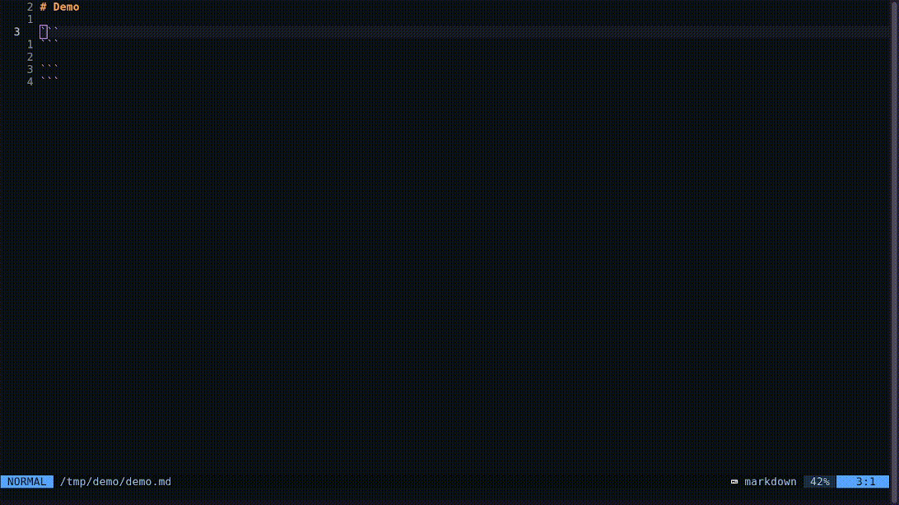

# ascii-text.nvim
A Neovim plugin to generate ASCII text using `figlet`

**Note: You need to have `figlet` installed on your system and available in your PATH.**

## Demo
 

## Table of Contents

- [Installation](#installation)
- [Setup](#setup)
- [Usage](#usage)
- [Configuration](#configuration)

## Installation

  Using [packer](https://github.com/wbthomason/packer.nvim):

  ```lua
  use {
    'nvim-telescope/telescope.nvim',
    requires = { 'nvim-lua/plenary.nvim' }
  }
  use { 'MarcHamamji/ascii-text.nvim' }
  ```

## Setup

  ```lua
  require('ascii-text').setup {
    -- Put your configuration here
  }
  ```

  This [configuration](#configuration)  will be passed to the `open` method, when called with no arguments.

## Usage

  ```lua
  require('ascii-text').open {
    -- Put your configuration here
  }
  ```

## Configuration

  | Field | Description | Available Values | Default |
  |---------------- | --------------- | --------------- | --------------- |
  | `output_width` | The maximum width, in characters, of the output. The output will be wrapped if it exceeds this amount. | Any valid number of charaters | 80 |
  | `spacing` | How much the characters should be close to each other. | `smushing` `kerning` `full-width` | `smushing` |
  | `justification` | The horizontal justification of the text. | `left` `center` `right` `auto` | `auto` |

  **Note:** All of the configuration options are actually flags to the `figlet` command. You can read more about them in its man page.
